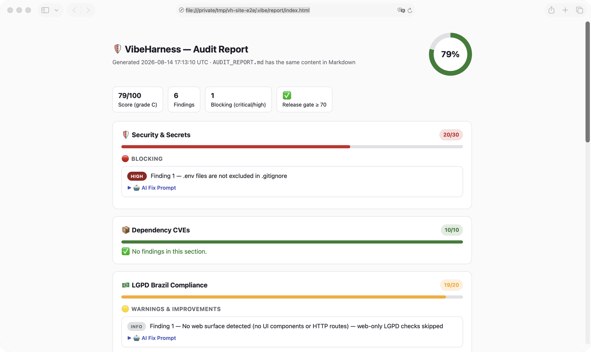

# `audit` — auditoria de prontidão para produção

Roda uma auditoria completa e gera o **Scorecard de Prontidão Comercial (0–100)**.

```bash
npx @vibeharness/cli audit                    # scorecard no terminal
npx @vibeharness/cli audit --report           # + AUDIT_REPORT.md com prompts de correção
npx @vibeharness/cli audit --site             # + relatório visual (.vibe/report/index.html)
npx @vibeharness/cli audit --fail-under 80    # exit 1 se score < 80 (para CI)
npx @vibeharness/cli audit --json             # findings + fix prompt em JSON
```

!!! tip "Com MCP instalado"
    A tool `vibe_audit` devolve os findings e o fix prompt sanitizado —
    a sua IA corrige os próprios achados e re-audita até passar do gate.

---

## Relatório visual (`.vibe/report/index.html`)



Com `--site` — ou aceitando o prompt após `--report` — o VibeHarness gera um
**site autocontido** (zero dependência, abre com um clique) com:

- :gauge: Score em destaque e meta do gate de lançamento
- :bar_chart: Cards por seção com barra de progresso
- :rotating_light: Findings por severidade, com o prompt de correção **copiável**
- :robot: O prompt em lote para corrigir todos os críticos de uma vez

Por pedir autorização e escrever em `.vibe/report/`, o relatório serve como
**documentação versionável** do status do projeto — commit após cada auditoria
importante e você terá o histórico da evolução da prontidão.

!!! info "Segurança do relatório"
    Findings vêm de nomes de arquivo e código (controláveis por um atacante).
    Todo conteúdo é sanitizado e escapado no HTML — o relatório não executa
    nada além dos botões de copiar.

---

## As 7 seções do scorecard

| Seção | Máx | O que verifica |
|-------|----:|----------------|
| :shield: Segurança & Segredos | 30 | 19 padrões de segredo, CORS wildcard, cookies sem flags, JWT inseguro, CSRF |
| :package: CVEs em dependências | 10 | `npm audit`/`pnpm audit`/`yarn npm audit`/`bun audit` (high/critical) |
| :flag-br: LGPD | 20 | PII em logs (CPF com checksum, telefone BR), consentimento, páginas obrigatórias, DSR (rotas, RPC, SQL), RLS, hash de senha |
| :broom: Código morto & higiene | 10 | god objects, console.logs, sugestões do knip |
| :floppy_disk: Integridade do banco | 10 | migrations versionadas vs `db push`/`drizzle-kit push` (package.json, CI e Dockerfile) |
| :building_construction: Infra & resiliência | 10 | health check (inclusive sub-rotas), rate limiting, error handlers — só em projetos com superfície web |
| :accessibility: Acessibilidade | 10 | alt ausente (`` e `<Image>`), botões sem label, inputs sem label associado (`id` só conta com `<label for>`) |

## AUDIT_REPORT.md: a correção já vem escrita

Cada finding traz um **AI Fix Prompt** pronto para colar no Cursor, Claude ou
Copilot. No final, um prompt em lote cobre todos os findings críticos/altos.

!!! success "Meta de lançamento"
    Score **≥ 70** e **zero findings críticos**. O CI instalado pelo `init`
    bloqueia PRs abaixo do gate automaticamente.

??? note "Falsos positivos e triagem"
    Desde a v0.8 os scanners **classificam** achados heurísticos antes de pontuar
    (triagem `real | fixture | env-reference | ci-ephemeral | static-message`) e
    rebaixam a severidade dos sabidamente benignos — sem nunca ocultá-los:

    - Valor que é referência a variável (`API_KEY="$VAR"`) → `env-reference` (info)
    - Placeholder óbvio (`'server-secret'`, `'test-key'`) → `fixture` (low)
    - URI de banco local/CI (`postgres:postgres@localhost`) → `ci-ephemeral` (low)
    - Palavra sensível em mensagem estática de log (sem dado) → `static-message` (info)

    Desde a **v0.8.2**, mais precisão estrutural: CPF de 11 dígitos só pontua
    com **checksum válido** (IDs e timestamps nunca viram PII), telefone exige
    marcador BR ou separadores, f-strings Python entram na triagem dinâmica,
    **código comentado nunca satisfaz heurística** (logs, consentimento,
    páginas, rate limit) e fixtures de teste não contam como app real.

    Para arquivos sabidamente benignos (fixtures com segredos falsos), crie
    `.vibe/auditignore` (sintaxe gitignore) — respeitado por todos os scanners.
    Projetos CLI/biblioteca não são cobrados por obrigações web (banner de
    cookies, páginas de privacidade, health check, rate limiting).

---

[:octicons-arrow-left-24: Anterior: `pack`](pack.md){ .md-button }
[:octicons-arrow-right-24: Próximo: `doctor`](doctor.md){ .md-button .md-button--primary }
